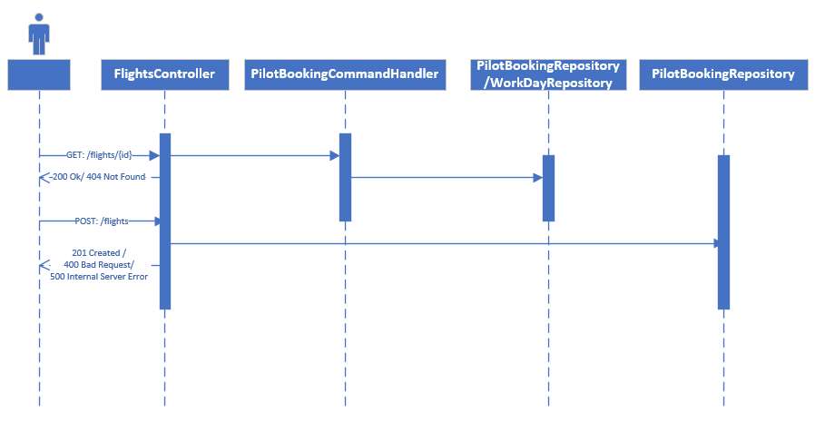

# CrewDemandService

## Technologies Used:

### Api:

1. .Net 5.0 Framework
2. In-Memory Sql
3. Swagger

### Unit Testing:
1. xUnit
2. Moq
3. AutoFixture

## How to run?

Use Visual Studio 2019 or Rider IDE and clone the master branch of this repository.

## Database

During the Startup, data from [pilot.json](/CrewDemandService/Infrastructure/Data/Pilot.json) is inserted in to in-memory database.

## Api

- Followed CQRS to segregate Command and Queries.
- Api's return necessary Status codes.
- Used [Weighted Interval Scheduling algorithm](/CrewDemandService/Api/QueryHandler/PilotQueryHandler.cs#:~:text=private%20IEnumerable%3CPilot%3E%20ApplyScheduleWaitingTime(IEnumerable%3CPilot%3E%20pilots)) to add weights based on their last return from trip.

## Followed Best Practices

- Unit Tests for Controllers, CommandHandlers and QueryHandlers
- Dependency Injection
- Followed some DDD principles

